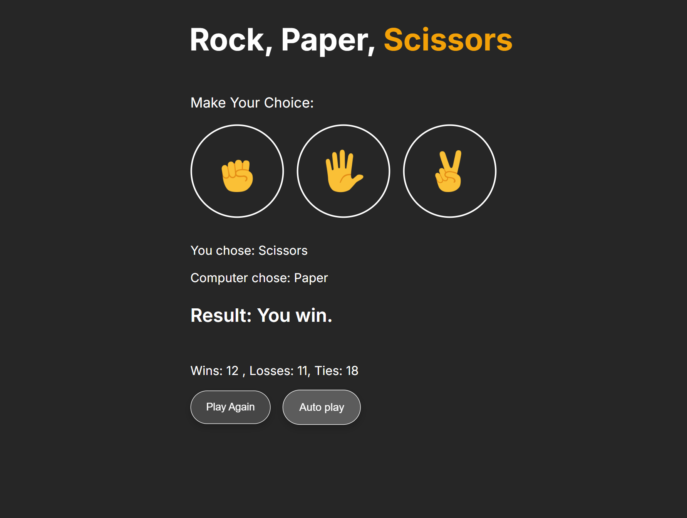

# ✊✋✌️ Rock Paper Scissors Game

A simple and interactive Rock Paper Scissors game built with **vanilla JavaScript**, **HTML5**, and **CSS3**. This project focuses on core JavaScript logic, DOM manipulation, and responsive UI behavior.

---

## 🚀 Features

- 🎮 Play Rock, Paper, Scissors against the computer  
- 🤖 Autoplay mode (automated gameplay simulation)  
- 📱 Mobile-friendly controls  
- 🚫 Double-tap zoom prevention for better UX on mobile  
- 🔄 Real-time result display (win, lose, draw)  
- 🧠 Randomized computer moves  

---

## 🛠️ Technologies Used

- HTML5  
- CSS3  
- Vanilla JavaScript (No frameworks or libraries)

---

## 🎯 How It Works

- The player selects a move (Rock, Paper, or Scissors)  
- The computer randomly generates its move  
- The game compares both moves and determines the result  
- The UI updates instantly to reflect the outcome  

Autoplay mode allows the game to simulate continuous rounds automatically.

---

## 🧩 What I Practiced in This Project

- DOM manipulation  
- Event handling  
- Game logic implementation  
- setTimeout / setInterval (for autoplay)  
- Responsive design basics  
- Mobile UX improvements  

---

## 📌 Author

**Timothy Korea** 
 
Frontend developer focused on building clean, structured, and responsive web interfaces while continuously improving development skills.  

---

## 📸 Preview

---

## Live Demo

[View Live Project]( https://timothykorea.github.io/rock-paper-scissors/)

---

## 📄 License

This project is open source and available under the MIT License.